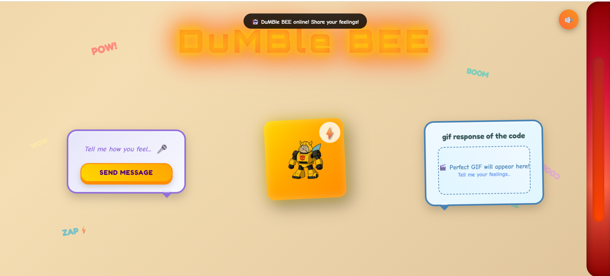
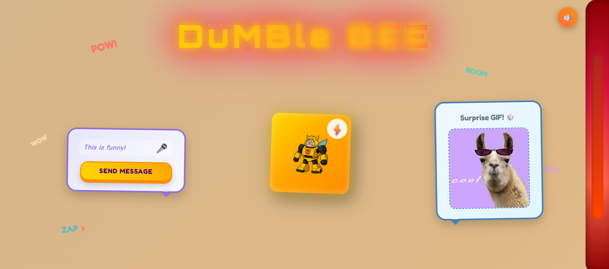

# DumBleBEE.1 🎯

## Basic Details
### Team Name: MARATHAKAM

### Team Members
- Team Lead: AKASH P R - ICCS College of Engineering & Management
- Member 2: SANDHRA REJI - ICCS College of Engineering & Management

### Project Description
A fun and interactive chatbot that responds to your **text or voice input** with **GIFs and memes** based on the keywords you use.  
DumBleBEE understands multiple emotions, reactions, and expressions and returns **accurate, updated GIFs** from Giphy/Tenor.
### The Problem (that doesn't exist)
the lack of meme culture in soceity.

### The Solution (that nobody asked for)
You can use the webpage and get the accurate memes and have fun......

## Technical Details
### Technologies/Components Used
For Software:
- Html,Css,Js
- Chatgpt-5
- Vs Code

### Project Documentation
For Software:

# Screenshots

# Build Photos

![Project Preview]

![Project Preview]

## Team Contributions
- Akash P R
- Sandhra Reji
---
Made with ❤ at TinkerHub Useless Projects 

